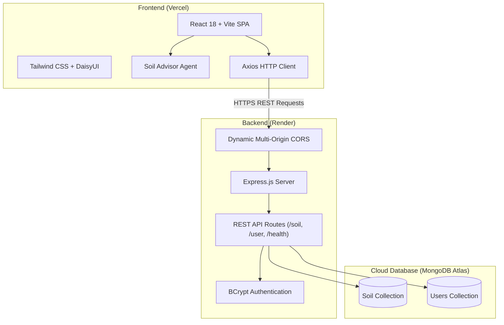

# 🌱 Soil Farming Agent

[](https://reactjs.org/)
[](https://vitejs.dev/)
[](https://nodejs.org/)
[](https://expressjs.com/)
[](https://www.mongodb.com/)
[](https://tailwindcss.com/)
[](https://soil-farming-agent.vercel.app)
[](https://soil-farming-agent.onrender.com)

> An intelligent, full-stack agro-tech web platform designed to empower farmers, agronomists, and agricultural stakeholders with precision soil intelligence, optimal crop matching, fertilizer scheduling, and sustainable soil health management.

---

## 🚀 Live Links

* **Live Frontend:** [https://soil-farming-agent.vercel.app](https://soil-farming-agent.vercel.app)
* **Live API Backend:** [https://soil-farming-agent.onrender.com](https://soil-farming-agent.onrender.com)
* **API Health Check:** [https://soil-farming-agent.onrender.com/health](https://soil-farming-agent.onrender.com/health)

---

## 🌟 Key Features

1. **Interactive Soil Farming Advisory Agent:**
   * Farmers can select their field soil classification (Alluvial, Black, Red & Yellow, Loam, Laterite, Sandy).
   * Input planting season (Kharif, Rabi, Zaid) and farming scale.
   * Generates actionable recommendations: optimal crop varieties, NPK fertilizer ratios, irrigation schedules, and agronomist tips with one-click report export.

2. **Comprehensive Soil Classification Directory:**
   * Dynamic catalog of major soil orders and agronomic properties.
   * Search by soil name or crop, with dynamic category filtering (All, Free, Premium).
   * Resilient client-side caching and fallback handling to maintain uptime during server spin-up cycles.

3. **Secure Authentication & User Management:**
   * BCrypt password hashing for secure user credentials.
   * Session state management via React Context API (`AuthProvider`).
   * Protected access to specialized agricultural research resources.

4. **Production-Hardened Cloud Architecture:**
   * Decoupled full-stack architecture with continuous deployment.
   * Multi-origin dynamic CORS validation supporting development, preview, and production domains.
   * Resilient environment-driven configuration with automatic local/production fallback resolution.

---

## 🏗️ System Architecture



---

## 🛠️ Tech Stack

| Domain | Technologies |
| :--- | :--- |
| **Frontend** | React 18, Vite, Tailwind CSS, DaisyUI, Axios, React Router v6, Slick Carousel, React Hot Toast |
| **Backend** | Node.js, Express.js (ES Modules), CORS, Dotenv |
| **Database** | MongoDB Atlas, Mongoose ODM |
| **Security** | BCrypt.js password hashing, origin validation whitelist |
| **Deployment** | Vercel (Frontend CI/CD), Render (Backend Web Service), MongoDB Atlas (Cloud Cluster) |

---

## 🔌 API Endpoints

| Method | Endpoint | Description | Public / Auth |
| :--- | :--- | :--- | :--- |
| `GET` | `/health` | Server liveness & health check | Public |
| `GET` | `/soil` | Fetch comprehensive soil catalogue | Public |
| `POST` | `/user/signup` | Register new user profile (BCrypt hashed) | Public |
| `POST` | `/user/login` | Authenticate existing user | Public |

---

## ⚙️ Local Development & Setup

### Prerequisites
* Node.js (v18 or higher)
* npm or yarn
* MongoDB Atlas connection URI (or local MongoDB instance)

### 1. Clone the Repository
```bash
git clone https://github.com/Aman8178/Soil_Farming_Agent.git
cd Soil_Farming_Agent
```

### 2. Backend Setup
```bash
cd Backend
npm install
```

Create a `.env` file in `Backend/`:
```env
PORT=4000
MongoDBURI=your_mongodb_connection_string_here
CLIENT_ORIGIN=http://localhost:5173,https://soil-farming-agent.vercel.app
```

Seed initial soil catalogue data:
```bash
npm run seed
```

Start backend development server:
```bash
npm start
```
*Backend runs on `http://localhost:4000`.*

### 3. Frontend Setup
```bash
cd ../Frontend
npm install
```

Create a `.env` file in `Frontend/`:
```env
VITE_API_BASE_URL=http://localhost:4000
```

Start frontend development server:
```bash
npm run dev
```
*Frontend runs on `http://localhost:5173`.*

---

## 💡 Real-World Challenges Solved

* **Cross-Origin Resource Sharing (CORS) in Cloud Environments:**  
  When deploying frontend and backend to separate cloud vendors (Vercel and Render), cross-origin requests were initially blocked. Solved this by implementing a robust CORS middleware whitelist that validates against configurable origins (`CLIENT_ORIGIN`) while seamlessly supporting local development.
* **Resilient Client Availability:**  
  Free-tier cloud backends occasionally enter sleep states after inactivity. Enhanced the frontend with client-side fallback data models and graceful error handling, ensuring users and recruiters always experience a functioning interface without blank errors.

---

## 👨‍💻 Author

* **Aman** - Full-Stack Developer
* GitHub: [@Aman8178](https://github.com/Aman8178)
* Live Project: [https://soil-farming-agent.vercel.app](https://soil-farming-agent.vercel.app)

---

## 📄 License
This project is licensed under the ISC License.
